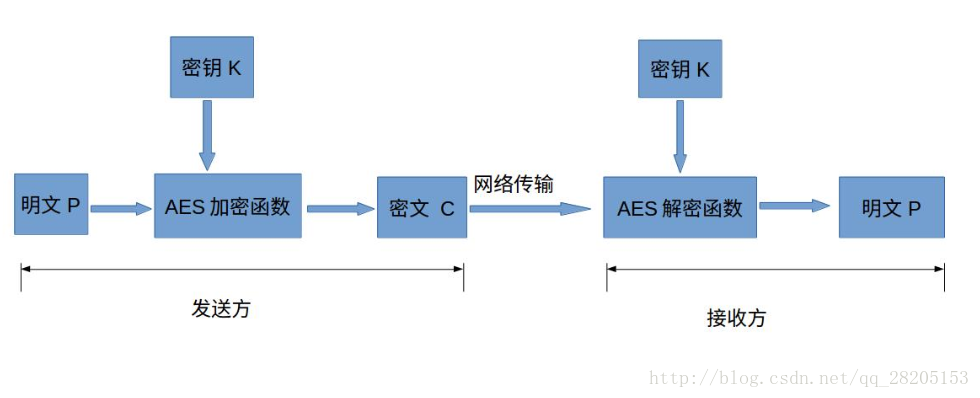

# AesTest
**a project about how to use AES to encrypt/decrypt bitmap/file or char/String in Android**

## Aes加/解密流程
&ensp;&ensp;&ensp;&ensp;aes一般应用在网络传输流程中,其基本流程如图  
<br/>


## 密钥
&ensp;&ensp;&ensp;&ensp;加解密的关键点：密钥！而密钥的保存，最安全的就是放在so库中保存


加密代码：
```
public static void aesEncrypt(InputStream ins, Context context, String title) {
        try {
            FileOutputStream fos = new FileOutputStream(context.getFilesDir() + File.separator + title + ".aes");
            //SecretKeySpec此类来根据一个字节数组构造一个 SecretKey
            SecretKeySpec sks = new SecretKeySpec(getAESSecretKey().getBytes(charset), KEY_ALGORITHM);
            //Cipher类为加密和解密提供密码功能,获取实例
            Cipher cipher = Cipher.getInstance(KEY_ALGORITHM);
            //初始化
            cipher.init(Cipher.ENCRYPT_MODE, sks);
            //CipherOutputStream 为加密输出流
            CipherOutputStream cos = new CipherOutputStream(fos, cipher);
            int b;
            byte[] d = new byte[1024];
            while ((b = ins.read(d)) != -1) {
                cos.write(d, 0, b);
            }
            cos.flush();
            cos.close();
        } catch (Exception e) {
            e.printStackTrace();
        }
    }
```

解密代码：
```
    public static byte[] aesDecrypt(InputStream ins) {
        byte[] bytes;
        ByteArrayOutputStream out = null;
        try {
            out = new ByteArrayOutputStream(1024);
            SecretKeySpec sks = new SecretKeySpec(getAESSecretKey().getBytes(charset), KEY_ALGORITHM);
            Cipher cipher = Cipher.getInstance(KEY_ALGORITHM);
            cipher.init(Cipher.DECRYPT_MODE, sks);
            //CipherInputStream 为加密输入流
            CipherInputStream cis = new CipherInputStream(ins, cipher);
            int b;
            byte[] d = new byte[1024];
            while ((b = cis.read(d)) != -1) {
                out.write(d, 0, b);
            }
            out.flush();
            cis.close();
            //获取字节流显示图片
            bytes= out.toByteArray();
        } catch (Exception e) {
            e.printStackTrace();
        } finally {
            if (out != null) {
                try {
                    out.close();
                } catch (IOException e) {
                    e.printStackTrace();
                }
            }
        }
        return bytes;
    }
```

加解密一些常用的转换工具方法：
```
    public static byte[] parseHexStr2Byte(String hexStr) {
        byte[] result = new byte[hexStr.length() / 2];
        for (int i = 0; i < hexStr.length() / 2; i++) {
            int high = Integer.parseInt(hexStr.substring(i * 2, i * 2 + 1), 16);
            int low = Integer.parseInt(hexStr.substring(i * 2 + 1, i * 2 + 2), 16);
            result[i] = (byte) (high * 16 + low);
        }
        return result;
    }

    public static String parseByte2HexStr(byte[] buf) {
        StringBuilder sb = new StringBuilder();
        for (byte b : buf) {
            String hex = Integer.toHexString(b & 0xFF);
            if (hex.length() == 1) {
                hex = '0' + hex;
            }
            sb.append(hex.toUpperCase());
        }
        return sb.toString();
    }
```

加解密一些常用的常量：
```
private static final String KEY_ALGORITHM = "AES";

private static final String CBC_PKCS5_PADDING = "AES/CBC/PKCS5Padding";

private static final Charset charset = StandardCharsets.UTF_8;

//IV must be specified in CBC mode
private static byte[] ivBytes = {0x00, 0x00, 0x00, 0x00, 0x00, 0x00, 0x00, 0x00, 0x00,
            0x00, 0x00, 0x00, 0x00, 0x00, 0x00, 0x00};
```